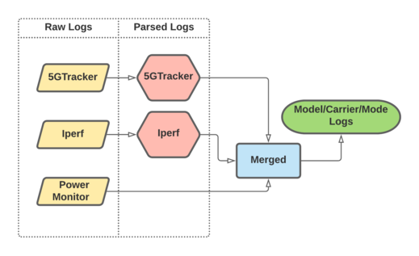

# LocA Power Wild Experiments

This folder contains the dataset and processing scripts for power experiments conducted using **5GTracker** and Monsoon Power Monitor at LocA.

## Data Processing Steps
The flow diagram below gives a brief overview of steps performed for processing the data for power experiments.



## Folder Structure
| Filename | Description |
|----------|-------------|
|`data/Loc-A-Wild-Summary.csv`|Summary file containing description for all the runs done|
|`data/client/[Device ID]-[5GTracker Session ID]-01.csv`|Raw session logs collected using 5GTracker|
|`data/client/[Device ID]-run[Iperf Run Number]-iPerf.txt`|Raw Iperf logs collected using 5GTracker|
|`data/baseline/base[Iperf Run Number].csv`|Baseline power collected using Monsoon Power Monitor|
|`data/power/run[Iperf Run Number].csv`|Raw power logs collected using Monsoon Power Monitor|
|`data-processed/iperf-logs/[Device ID]-run[Iperf Run Number].csv`|Processed iperf logs for each run|
|`data-processed/session-logs/[Device ID]-[5GTracker Session ID]-01.csv`|Processed 5GTracker logs for each run|
|`data-processed/merged-logs/[Device ID]-run[Iperf Run Number]`|Processed logs generated after merging processed iperf logs, processed 5GTracker logs and raw power logs|
|`data-processed/Loc-A-Wild_combined.csv`|Combined file containing merged logs for all runs. See the [Dataset Description](#dataset-description) section for more details|
|`data-processed/cleaned-logs/[Model]_[Carrier]_[Network Type]_[Direction].csv`|Cleaned data for each Model [S20, S10], Carrier [Verizon, T-Mobile], Network Type [NSA+LTE, SA, mmWave] and Direction [uplink, downlink]| 
|`01-Process-Iperf-Logs.py`|Python script to process raw Iperf logs for each run|
|`02-Process-5GTracker-Logs.py`|Python script to process raw 5GTracker logs for each run|
|`03-Merge-Walking-Loops.py`|Python script to merge processed logs from 3 sources shown in [Data Processing Steps](#data-processing-steps)|
|`04-Combine-Walking-Loops.py`|Python script to generate combined data file for all runs|
|`05-Prepare-Data-Modeling.py`|Python script to generate separate data files for each model/carrier/network-type/ configuration|

## Dataset Description
| Field Name | Description |
|-------------|-------------|
|`compassAccuracy`|Compass accuracy reported by Android API|
|`compassDirection`|Compass direction reported by Android API|
|`currentNow`|Current value exposed by sysfs interface|
|`latitude`|Latitude position of mobile device|
|`locationAccuracy`|Location accuracy reported by Android API|
|`longitude`|Longitude position of mobile device|
|`mobileRx`|Number of received bytes on cellular interface|
|`mobileTx`|Number of transmitted bytes on cellular interface|
|`movingSpeed`|Moving speed of the mobile device|
|`movingSpeedAccuracyMPS`|Moving speed accuracy reported by Android API|
|`nrStatus`|Mobile device connected to 5G NR or not|
|`nrStatus_array`|NR status sequence seen in each second|
|`nr_ssRsrp`|Max Reference Signal Received Power for current NR cell in each second|
|`nr_ssRsrp_avg`|Average Reference Signal Received Power for current NR cell in each second|
|`nr_ssSinr`|Max Signal to Interference & Noise Ratio for current NR cell in each second|
|`nr_ssSinr_avg`|Average Signal to Interference & Noise Ratio for current NR cell in each second|
|`rsrp`|Max Reference Signal Received Power for current LTE cell in each second|
|`rsrp_avg`|Average Reference Signal Received Power for current LTE cell in each second|
|`voltageNow`|Voltage value exposed by sysfs interface|
|`downlink_mbps`|Downlink throughput observed |
|`uplink_mbps`|Uplink throughput observed |
|`sw_power`|Raw Power calculated using current and voltage values exposed by sysfs interface|
|`sw_power_rolled`|Power calculated using current and voltage values after with a rolling window|
|`sw_power_baseline`|Power calculated using current and voltage values after subtracting baseline power |
|`Throughput`|Throughput seen during Iperf interval (Mbps)|
|`run_number`|Iperf run number for current data sample|
|`time_since_start`|relative time since the start of an experiment (sec)|
|`avg_power`|Average power observed by Monsoon Power Monitor in each second|
|`avg_power_rolled`|Average power observed by Monsoon Power Monitor in each second after using a rolling window|
|`avg_power_baseline`|Average power observed by Monsoon Power Monitor after subtracting baseline power|
|`provider`|Service provider (Verizon, T-Mobile)|
|`network_type`|Network Type for each run (NSA+LTE, SA, mmWave)|
|`direction`|Direction of Iperf data transfer (Uplink, Downlink)|


## Generating Results
The scripts will process the data used for power model generation.

### Requirements
Here are the software/package requirements. The version number in the bracket indicates the minimum version that our script has been tested on.

- Python 3 (3.7.7 and higher)
- Pandas (1.1.3 and higher)
- scikit-learn	(0.24.1 and higher)
- seaborn (0.11.1 and higher)

### Running code
The processed logs can be found in `data-processed` folder. 

Note that we have only put the experiment summary file `Loc-A-Wild-Summary.csv` in the `data` folder due to the file size of raw logs. To regenerate all logs, download the data from [google-drive](https://drive.google.com/drive/folders/1yxmJr3zl5dn81d1LLHwyOI--6l0hOcYE?usp=sharing) and put it in the `data` folder.

To generate the logs from scratch, the following commands can be used. 

```bash
python3 01-Process-Iperf-Logs.py && \
python3 02-Process-5GTracker-Logs.py && \
python3 03-Merge-Walking-Loops.py && \
python3 04-Combine-Walking-Loops.py && \
python3 05-Prepare-Data-Modeling.py
```

The processed logs will be placed in `data-processed` folder. The [Folder Structure](#folder-structure) section gives a detailed overview of all the files in `data-processed` folder.
